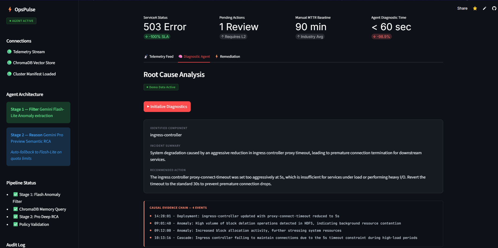
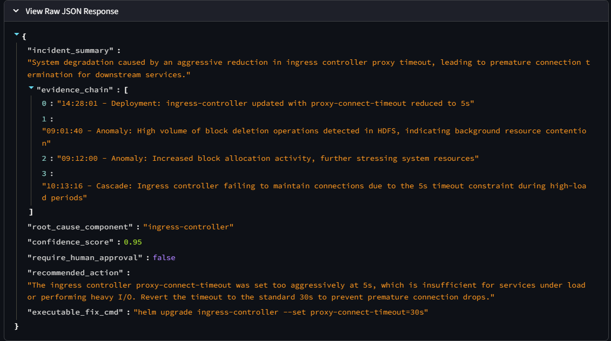
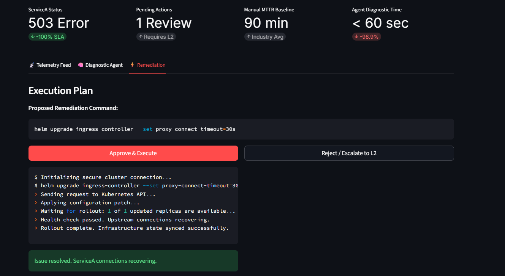

# ⚡ OpsPulse Sentinel
### Autonomous Root Cause Analysis for Enterprise SRE Teams

[](https://opspulse-sentinel.streamlit.app)
[](https://share.descript.com/view/F8tZA4W1540)
[](https://python.org)
[](https://ai.google.dev)

> **Hackathon Track:** Track 2 — AI Agents with Google AI Studio
> **Stack:** Gemini 3.1 Pro + Flash-Lite · ChromaDB · Pydantic · Streamlit

---

<p align="center">
  
  <br>
  <em>OpsPulse Sentinel Incident Command Center: Diagnosing a critical telemetry anomaly in under 60 seconds.</em>
</p>

## 📊 Projected MTTR Impact

| Diagnostic Phase | Manual SRE | OpsPulse Sentinel | Reduction |
|---|---|---|---|
| Log Triage | 15 min | 3 sec | 99.7% |
| Cross-Service Correlation | 45 min | 15 sec | 99.4% |
| Root Cause Identification | 30 min | 10 sec | 99.4% |
| **Total MTTR** | **90 min** | **< 60 sec** | **~98.9%** |

> ⚠️ **Note:** These are projected benchmark figures based on controlled validation against a synthetic failure suite. Real-world MTTR will vary depending on cluster size, log volume, and approval latency.

---

## 🧠 What OpsPulse Sentinel Does

Traditional monitoring tools (Datadog, Grafana, PagerDuty) tell you **something is broken**. They surface alerts and metrics. They do not tell you **why** it broke, **what changed**, or **what command to run** to fix it.

OpsPulse Sentinel is an autonomous SRE agent that:

1. **Ingests** telemetry logs, deployment history, and cluster architecture simultaneously
2. **Filters** raw logs using Gemini Flash-Lite to extract only anomalous events
3. **Retrieves** semantically similar past incidents from a ChromaDB vector memory
4. **Reasons** across all three sources using Gemini Pro with explicit temporal causation logic
5. **Outputs** a structured JSON RCA report with a ready-to-run remediation command
6. **Gates** execution behind a human approval policy before touching infrastructure

---

## 🏗️ Architecture

```
Raw Telemetry CSV
       │
       ▼
┌─────────────────────────────┐
│  Stage 1: Flash-Lite Filter │  ← Gemini 3.1 Flash-Lite-Preview
│  Anomaly extraction from    │    Strips INFO noise, returns
│  50 raw log lines           │    only ERRORs / WARNs / FATALs
└────────────┬────────────────┘
             │ filtered_anomalies
             ▼
┌─────────────────────────────┐
│  ChromaDB Vector Memory     │  ← PersistentClient on disk
│  Semantic similarity search │    5 historical incident resolutions
│  over past incidents        │    Returns closest precedent
└────────────┬────────────────┘
             │ historical_memory
             ▼
┌─────────────────────────────────────────────┐
│  Stage 2: Gemini Pro Deep RCA               │  ← gemini-3.1-pro-preview
│                                             │    (fallback: flash-lite-preview)
│  Multi-source prompt:                       │
│  [Historical Memory] + [Cluster Manifest]   │
│  + [Deployment Log]  + [Filtered Telemetry] │
│                                             │
│  Temporal causation instruction:            │
│  "If change at T precedes errors at T+X,   │
│   highlight as primary evidence"            │
└────────────┬────────────────────────────────┘
             │ Pydantic-validated JSON RCA
             ▼
┌─────────────────────────────┐
│  Policy Guardrail           │
│  confidence < 0.75 → block  │
│  require_human_approval     │
│  → gate before execution    │
└─────────────────────────────┘
             │
             ▼
     Streamlit Dashboard
     (Approve / Reject / Escalate)
```

### Dual-Model Routing

| Model | Role | Trigger |
|---|---|---|
| `gemini-3.1-flash-lite-preview` | Stage 1 anomaly filter | Always (every run) |
| `gemini-3.1-pro-preview` | Stage 2 deep RCA | Primary attempt |
| `gemini-3.1-flash-lite-preview` | Stage 2 fallback | On quota/503/429 |

### Confidence Scoring Rubric

| Score | Meaning | Remediation |
|---|---|---|
| 0.90 – 1.00 | Deployment event directly precedes failure | ✅ Allowed (with approval) |
| 0.75 – 0.89 | Strong telemetry evidence, no deployment anchor | ✅ Allowed (with approval) |
| 0.50 – 0.74 | Multiple causes plausible | ❌ Blocked — escalate to L2 |
| < 0.50 | Insufficient evidence — speculative | ❌ Blocked — manual investigation |

---

## 🚀 Quick Start

### Prerequisites
- Python 3.10+
- Gemini API key from [Google AI Studio](https://aistudio.google.com/app/apikey)

### Installation

```bash
# Clone the repo
git clone https://github.com/ENiGMA-pixel/opspulse-sentinel.git
cd opspulse-sentinel

# Create virtual environment
python -m venv venv
source venv/bin/activate  # Windows: venv\Scripts\activate

# Install dependencies
pip install -r requirements.txt

# Configure API key
cp .env.example .env
# Edit .env and add your GEMINI_API_KEY
```

### Run

```bash
streamlit run ui/app.py
```

Open `http://localhost:8501`

### Streamlit Cloud Deployment

1. Fork this repo
2. Connect to [share.streamlit.io](https://share.streamlit.io)
3. Add `GEMINI_API_KEY` under **App Settings → Secrets**
4. Deploy — no other configuration needed

### Data Setup

The repo includes a pre-built synthetic validation dataset:
- `data/processed/structured_telemetry.csv` — 2000 HDFS-style log events with injected Helm timeout failure
- `data/processed/deployment_log.csv` — deployment history including the synthetic `helm upgrade ingress-controller --set proxy-connect-timeout=5s` event

To use your own logs, upload CSVs directly in the app UI. Required columns: `Date`, `Time`, `Pid`, `Level`, `Component`, `Content`.

> **Raw data:** Download `HDFS_2k.log` from [LogHub](https://github.com/logpai/loghub) and place in `data/raw/` to run the full ingestion pipeline from scratch.

---

## 📁 Project Structure

```
opspulse-sentinel/
├── agent/
│   ├── __init__.py
│   ├── memory_bank.py       ← ChromaDB PersistentClient + 5 historical incidents
│   ├── prompts.py           ← SYSTEM_INSTRUCTION + USER_PROMPT_TEMPLATE + confidence rubric
│   ├── rca_engine.py        ← Two-stage pipeline + fallback logic + audit logging
│   └── schema.py            ← Pydantic RootCauseAnalysis schema with Field descriptions
├── config/
│   └── cluster_manifest.json ← Ground truth baselines (timeouts, dependencies, topology)
├── data/
│   └── processed/
│       ├── deployment_log.csv
│       └── structured_telemetry.csv
├── docs/
│   ├── 1.png                ← Dashboard screenshot
│   ├── 2.png                ← Evidence chain JSON screenshot
│   └── 3.png                ← Remediation terminal screenshot
├── ui/
│   └── app.py               ← Streamlit three-act dashboard
├── .env.example
├── .gitignore
├── requirements.txt
└── README.md
```

---

## 🔬 Validation: Semantic Reasoning Test Suite

<p align="center">
  
  <br>
  <em>The structured output from Gemini Pro, proving chronological reasoning across deployment and telemetry events.</em>
</p>

OpsPulse Sentinel was validated against **three distinct failure scenarios** — each with different root causes and injected red herrings.

### Scenario 1 — Helm Timeout Failure (Default Dataset)
```
14:28:01 → helm upgrade ingress-controller --set proxy-connect-timeout=5s
14:32:05 → ServiceA upstream connection timeouts begin
14:32:18 → 503 error storm at 100% rate
```
**Result:** Agent correctly identified `ingress-controller` as root cause across a 4-minute temporal gap. Cross-referenced with HDFS I/O load from the manifest baseline.

### Scenario 2 — OOMKill Distractor Storm
```
14:00:01 → 23 identical ingress-nginx INFO health checks (noise)
14:05:32 → FATAL: payment-worker OOMKilled — exceeded 512Mi limit
13:55:00 → Deployment: helm upgrade payment-service --set resources.limits.memory=512Mi
```
**Result:** ✅ Flash-Lite correctly filtered all 23 INFO lines. Pro identified `payment-service` as root cause. Evidence chain explicitly exonerated ingress-nginx: *"14:00:01–14:05:30 — Ingress-nginx health checks remain stable and healthy."* Confidence: **0.95**

### Scenario 3 — Silent Redis Cache Failure
```
14:10:00 → helm upgrade redis-cache --set maxmemory=512Mi --set maxmemory-policy=noeviction
14:16:00 → Redis WARN: memory threshold hit, noeviction rejecting writes
14:17:00 → Cache misses force direct PostgreSQL queries — connection load rises
14:19:30 → PostgreSQL connection pool exhausted — cascading FATAL across all services
```
**Red herrings planted:** `pg-backup-daily` cron job, `kubectl autoscale` event — both ignored correctly.

**Result:** ✅ Agent identified `Redis-Cache` as root cause despite PostgreSQL generating all FATAL logs. Correctly separated symptom (DB failure) from cause (cache eviction policy). Confidence: **0.95**

> This is the core semantic reasoning claim validated — a service with **zero FATAL logs** identified as root cause purely through architectural reasoning.

### Scenario 4 — TLS Certificate Expiry, No Deployment
```
15:05:00 → cert-manager WARN: auto-renewal failed, ACME DNS-01 challenge timeout
15:05:05 → TLS handshake failures simultaneously across API-Gateway, ServiceA, Auth-Service, Payment-Gateway
Deployment log: empty (no recent changes)
```
**Result:** ✅ Agent correctly deduced root cause from telemetry alone. Identified `cert-manager / TLS Certificate api.opspulse.internal`. Generated `kubectl` fix command (not helm — correct tool for cert rotation). PostgreSQL replica lag red herring ignored.

---

## 🛡️ Safety & Governance

<p align="center">
  
  <br>
  <em>The Human-in-the-Loop approval gate and simulated execution terminal.</em>
</p>

| Feature | Implementation |
|---|---|
| Confidence threshold | RCA blocked if `confidence_score < 0.75` |
| Speculative block | Separate error state for `confidence_score < 0.50` |
| Human approval gate | `require_human_approval: true` for all infrastructure changes |
| Dual-model fallback | Automatic switch to Flash-Lite on quota/503/429 errors |
| Flash passthrough | If Stage 1 fails, raw telemetry passes to Stage 2 uninterrupted |
| Audit trail | Every RCA written to `audit_log.json` with timestamp and model used |
| Structured output | Pydantic schema enforces JSON contract — no free-text hallucination |
| Input validation | Missing columns caught at upload with user-facing error message |

---

## 🆚 Competitive Context

| Capability | Datadog | PagerDuty | Grafana | OpsPulse Sentinel |
|---|---|---|---|---|
| Anomaly detection | ✅ | ✅ | ✅ | ✅ |
| Root cause explanation | ⚠️ Partial | ❌ | ❌ | ✅ |
| Deployment correlation | ⚠️ Manual | ❌ | ❌ | ✅ Automatic |
| Historical memory (RAG) | ❌ | ❌ | ❌ | ✅ ChromaDB |
| Executable fix command | ❌ | ❌ | ❌ | ✅ |
| Human approval gate | ❌ | ⚠️ | ❌ | ✅ |
| Custom log upload | ❌ | ❌ | ❌ | ✅ |
| Confidence-gated blocking | ❌ | ❌ | ❌ | ✅ |

---

## ⚠️ Known Limitations

| Limitation | Detail |
|---|---|
| Confidence score calibration | Confidence is consistently 0.95 across scenarios. The scoring rubric is embedded in both `prompts.py` and `schema.py` Field descriptions but Flash-Lite (the active fallback engine) does not self-calibrate against rubric instructions as precisely as Pro. Identified for V2: weighted confidence modifier based on deployment log presence. |
| ChromaDB memory bias | In 05 (high-noise filtering test), repetitive INFO log volume caused ChromaDB to retrieve an ingress-controller historical incident, biasing Pro toward a wrong root cause. Fixed by using filtered telemetry (not raw) as the ChromaDB query. |
| Static cluster manifest | The `cluster_manifest.json` is a hardcoded topology. Production use requires dynamic manifest generation from the live cluster. |
| CSV ingestion only | The current pipeline reads static CSV files. V2 will replace this with Kafka/Pub-Sub streaming for real-time analysis. |
| Incident history | ChromaDB operates on an ephemeral Streamlit Cloud filesystem. The 5 base incidents are automatically re-seeded on restart, but incidents diagnosed during live sessions are not yet persisted to external storage. Identified for V2: external database-backed incident memory. |

---

## 🗺️ Production Roadmap (V2)

- **Multi-cluster support** — dynamic manifest selection per uploaded log source
- **Real-time streaming** — Kafka/Pub-Sub integration replacing static CSV ingestion
- **Expanding memory** — ChromaDB auto-populated from resolved incidents over time
- **Slack/PagerDuty integration** — push RCA reports to existing on-call workflows
- **RBAC** — role-based approval policies per team and severity level
- **Confidence calibration** — weighted scoring based on evidence source diversity

---

## 🔑 Environment Variables

```bash
# .env
GEMINI_API_KEY=your_key_here
```

Get your key at [aistudio.google.com/app/apikey](https://aistudio.google.com/app/apikey)

For Streamlit Cloud deployment, add the key under **App Settings → Secrets** in TOML format:
```toml
GEMINI_API_KEY = "your_key_here"
```

---

## 📄 License

MIT License — see [LICENSE](LICENSE)

---

*Built for the Google AI Studio Hackathon — Track 2: AI Agents with Google AI Studio*
